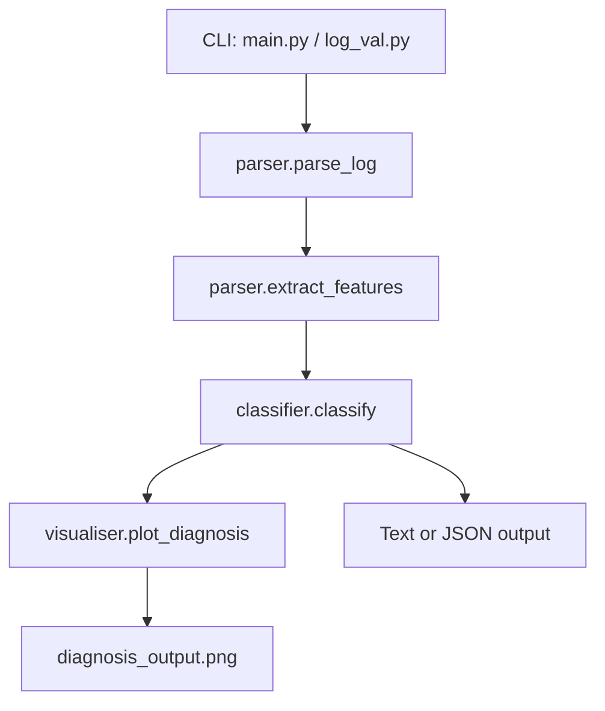

# alda

ArduPilot Log Diagnosis Assistant.

ALDA analyzes ArduPilot DataFlash logs (`.bin`/`.log`) and produces a ranked diagnosis with confidence, evidence, suggested fixes, and a plot artifact.

## What It Does

- Parses DataFlash telemetry using `pymavlink`
- Extracts features from key message families (`VIBE`, `EKF4/EKF1`, `ATT`, `GPS`, `BAT`, `COMPASS`, `ESC`, `RCOU`, `MODE`, `ERR`, `EV`)
- Runs rule-based classification with causal ordering
- Handles missing telemetry streams gracefully (including missing `COMPASS`)
- Supports machine-consumable JSON output for API integration
- Generates a PNG diagnosis chart using `matplotlib` with `Agg` backend (no display server required)

## Current Failure Classes

- `vibration_high`
- `ekf_failure`
- `compass_interference`
- `gps_glitch`
- `motor_imbalance`
- `power_issue`
- `rc_failsafe`
- `thrust_loss`
- `unknown`

## Repository Structure

```text
alda/
├── main.py            # Primary CLI and pipeline orchestration
├── parser.py          # parse_log + extract_features
├── classifier.py      # classify + thresholds + causal arbiter + confidence floor
├── visualiser.py      # plot_diagnosis (Agg backend)
├── log_val.py         # Entry-point shim to main CLI
├── log_analyzer.py    # Backward-compat wrapper around run_analysis
├── rules.py           # Backward-compat classify/thresholds facade
├── plot_output.py     # Backward-compat plot_diagnosis facade
├── report_output.py   # Legacy terminal report helper
├── tests/
│   └── test_rules.py
├── requirements.txt
└── README.md
```

## Processing Flow



##  CLI Output 


##  Generated Output 


## Installation

```bash
python -m venv .venv
source .venv/bin/activate
pip install -r requirements.txt
```

## Usage

### Standard CLI

```bash
python main.py <path_to_log.bin>
```

### Alternative entrypoint

```bash
python log_val.py <path_to_log.bin>
```

### CLI options

```bash
python main.py <path_to_log.bin> --show-thresholds
python main.py <path_to_log.bin> --verbose
python main.py <path_to_log.bin> --json
```

- `--show-thresholds`: prints active classifier thresholds
- `--verbose`: prints all extracted features (default shows a subset)
- `--json`: emits structured JSON payload (for API usage)

## JSON Output Schema (Top-Level)

`--json` returns:

- `log_file`
- `flight_time_sec`
- `message_counts`
- `features`
- `diagnosis` (ordered list of `{class, confidence, evidence}`)
- `root_cause`
- `root_confidence`
- `plot_path`

On failure, JSON mode returns:

```json
{
  "error": "..."
}
```

## Notes on Diagnosis Logic

- RC failsafe detection considers:
  - `ERR.Subsys == 3`
  - `MODE` transitions to RTL/LAND (`11`/`9`) without detected pilot input
- Compass interference is confidence-penalized when extreme vibration or severe power collapse likely explains magnetometer excursions
- Low-confidence suppression demotes weak candidates (default floor: `0.45`) into `unknown` notes
- Causal arbiter preserves ordering and annotates downstream effects (for example, vibration→EKF and power→vibration)

## Tests

Run all tests:

```bash
python -m pytest -q
```

Run classifier-focused tests:

```bash
python -m pytest -q tests/test_rules.py
```

## Log-File Link

```text
https://discuss.ardupilot.org/uploads/default/original/3X/7/6/76e9fe83154fe88ff318770a60b493056acb5ad0.bin
```

## License

GPL v3. See `LICENSE`.
