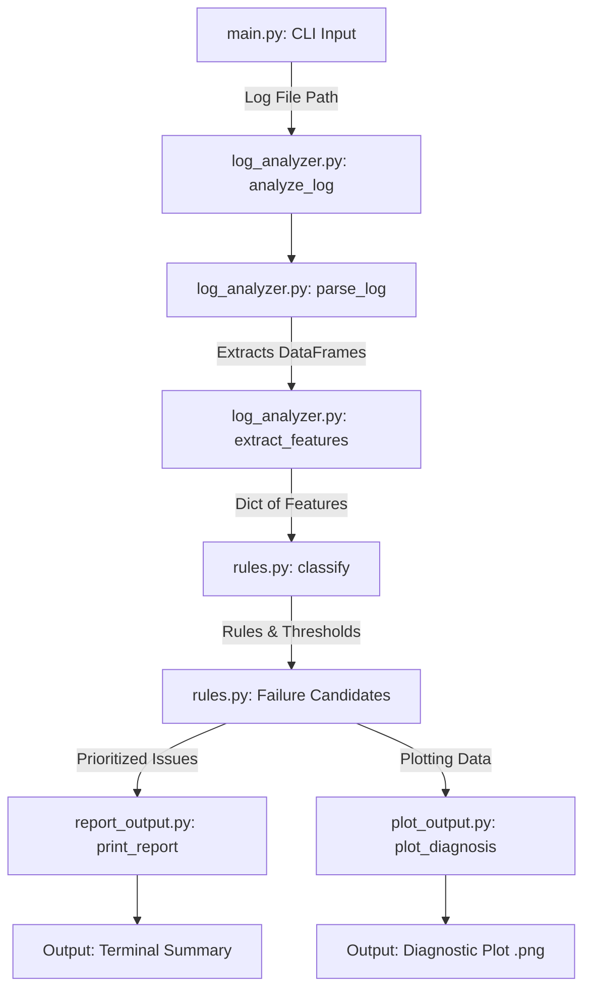

# alda

ArduPilot Log Diagnosis Assistant

alda is an AI-assisted diagnostic tool for ArduPilot `.bin` logs. It automatically extracts key features, analyzes telemetry data for common failure patterns, and provides actionable suggestions to resolve issues.

## Features

- Analyzes vibration, EKF variance, GPS degradation, compass interference, power issues, and motor imbalance.
- Generates visual multi-panel diagnostic plots for insightful tracking.
- Friendly command-line interface with a clean report summary.
- Output generation is modular:
    - PNG chart generation lives in `plot_output.py`
    - Terminal summary rendering lives in `report_output.py`
- Modular architecture allowing for easy integration into other pipelines.

## Project Structure

```text
alda/
├── main.py          # Command-line entry point
├── log_analyzer.py  # Core parsing, feature extraction, and diagnosis orchestration
├── plot_output.py   # PNG plot generation and visualization layout
├── report_output.py # Terminal report rendering
├── rules.py         # Diagnostic rules, threshold definitions, and classification logic
├── README.md        # Project documentation
└── .gitignore       # Git ignore rules for logs, plot outputs, and python cache
```

## System Flow Diagram



## Prerequisites

Ensure you have the required Python packages installed:

```bash
pip install -r requirements.txt
```

## Usage

Run the main script by providing the path to an ArduPilot `.bin` log:

```bash
python main.py <path_to_log.bin>
```

You can also view the current classification thresholds by running:

```bash
python main.py <path_to_log.bin> --show-thresholds
```

## Example Run

#### Generated Output 


#### CLI Output 

